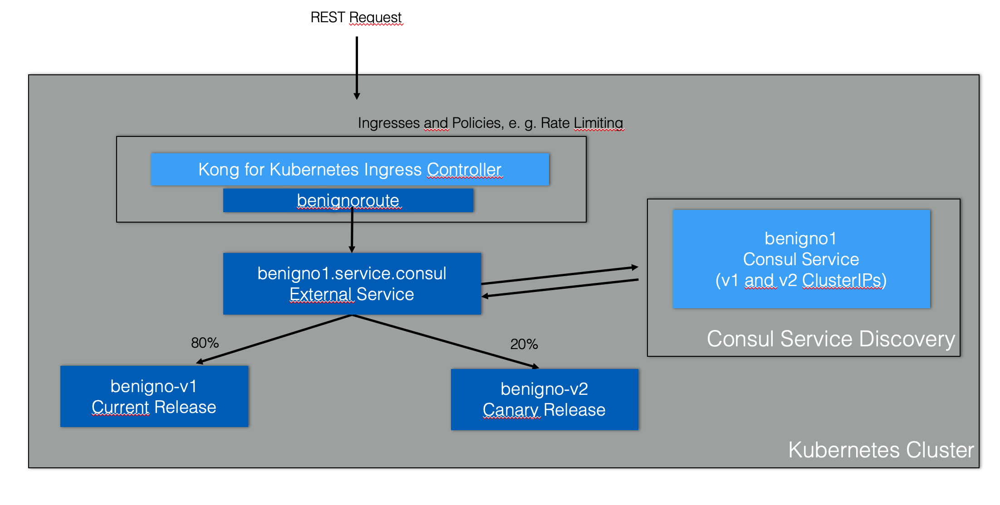
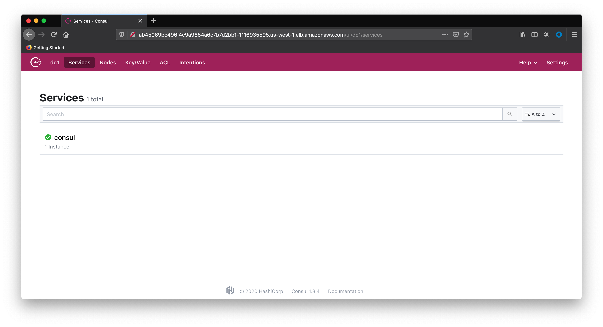

## Consul Service Discovery with Kong Ingress Controller on Kubernetes

### Table of Contents
- [Overview](#overview)
- [Architectture](#architecture)
- [System Requirements](#system-requirements)
- [Installation](#installation)
- [Contributing](#contributing)
- [Support](#support)
- [License](#license)

### Overview
From Kong API Gateway perspective, using Consul as its Service Discovery infrastructure is one of the most well-known and common integration use cases. This exercise shows how to integrate Kong for Kubernetes (K4K8S), the Kong Ingress Controller based on the Kong API Gateway, with Consul Service Discovery running on an Kubernetes EKS Cluster.

Kong for Kubernetes can implement all sort of policies to protect the Ingresses defined to expose Kubernetes services to external Consumers including Rate Limiting, API Keys, OAuth/OIDC grants, etc.

### Architecture
The following diagra describes the Kong for Kubernetes Ingress Controller and Consul Service Discovery implementing a Canary Release:

### System Requirements

- A Kubernetes Cluster. This exercise was done on an AWS EKS Cluster. Both Consul Connect and Kong Enterprise support any Kubernetes distribution.
- kubectl
- Helm 3.x
- Consul CLI
- HTTPie and Curl.

### Installation

#### Step 1: Consul Installation

1. Add HashiCorp repo to your local Helm installation.

<pre>
helm repo add hashicorp https://helm.releases.hashicorp.com
</pre>

2. Use the following [YAML file](artifacts/consul-values.yml) to install Consul.

<pre>
global:
  datacenter: dc1
  image: "consul:1.8.4"

# Expose the Consul UI through this LoadBalancer
ui:
  service:
    type: LoadBalancer

# Configure a Consul client on Kubernetes nodes. GRPC listener is required for Connect.
client:
  enabled: true
  grpc: true

# Minimal Consul configuration. Not suitable for production.
server:
  replicas: 1
  bootstrapExpect: 1
  disruptionBudget:
    enabled: true
    maxUnavailable: 0

# Sync Kubernetes and Consul services
syncCatalog:
  enabled: false
</pre>

3. Create a Namespace for Consul
<pre>kubectl create namespace hashicorp</pre>

4. Install Consul Connect

<pre>
helm install consul-connect -n hashicorp hashicorp/consul -f consul-values.yml
</pre>

5. Check the installation

<pre>
$ kubectl get pod --all-namespaces
NAMESPACE     NAME                       READY   STATUS    RESTARTS   AGE
hashicorp     consul-consul-server-0     1/1     Running   0          45s
hashicorp     consul-consul-xndhd        1/1     Running   0          45s
kube-system   aws-node-rb528             1/1     Running   0          5m26s
kube-system   coredns-556765db45-qm7hc   1/1     Running   0          11m
kube-system   coredns-556765db45-wsctq   1/1     Running   0          11m
kube-system   kube-proxy-v2mkd           1/1     Running   0          5m26s
</pre>

<pre>
$ kubectl get service --all-namespaces
NAMESPACE     NAME                   TYPE           CLUSTER-IP       EXTERNAL-IP                                                               PORT(S)                                                                   AGE
default       kubernetes             ClusterIP      10.100.0.1       <none>                                                                    443/TCP                                                                   12m
hashicorp     consul-consul-dns      ClusterIP      10.100.55.251    <none>                                                                    53/TCP,53/UDP                                                             65s
hashicorp     consul-consul-server   ClusterIP      None             <none>                                                                    8500/TCP,8301/TCP,8301/UDP,8302/TCP,8302/UDP,8300/TCP,8600/TCP,8600/UDP   65s
hashicorp     consul-consul-ui       LoadBalancer   10.100.193.197   ab45069bc496f4c9a9854a6c7b7d2bb1-1116935595.us-west-1.elb.amazonaws.com   80:32688/TCP                                                              65s
kube-system   kube-dns               ClusterIP      10.100.0.10      <none>                                                                    53/UDP,53/TCP                                                             11m
</pre>

Check the Consul Connect services redirecting your browser to Consul UI:

#### Step 2: Configure Consul DNS
<pre>
kubectl get service consul-consul-dns -n hashicorp -o jsonpath='{.spec.clusterIP}'
10.100.55.251
</pre>

<pre>
kubectl edit configmap coredns -n kube-system
# Please edit the object below. Lines beginning with a '#' will be ignored,
# and an empty file will abort the edit. If an error occurs while saving this file will be
# reopened with the relevant failures.
#
apiVersion: v1
data:
  Corefile: |
    .:53 {
        errors
        health {
           lameduck 5s
        }
        ready
        kubernetes cluster.local in-addr.arpa ip6.arpa {
           pods insecure
           fallthrough in-addr.arpa ip6.arpa
           ttl 30
        }
        prometheus :9153
        forward . /etc/resolv.conf
        cache 30
        loop
        reload
        loadbalance
    }
    consul {
        errors
        cache 30
        forward . 10.100.55.251
    }
kind: ConfigMap
metadata:
  creationTimestamp: "2020-06-19T13:42:16Z"
  managedFields:
  - apiVersion: v1
    fieldsType: FieldsV1
    fieldsV1:
      f:data:
        .: {}
        f:Corefile: {}
    manager: kubeadm
    operation: Update
    time: "2020-10-19T13:42:16Z"
  name: coredns
  namespace: kube-system
  resourceVersion: "178"
  selfLink: /api/v1/namespaces/kube-system/configmaps/coredns
  uid: 698c5d0c-998e-4aa4-9857-67958eeee25a
</pre>

#### Step 3: Deploy Sample Microservice and Canary

Canary description

1. Deploy Sample Microservice

Use the following declarations to deploy the Sample Microservice, [Sample Deployment](artifacts/deployment_benigno_v1.yaml) and [Sample Service](artifacts/service_benigno.yaml)

After the deployment you should see the new Kubernetes Pods as well as the new Consul Services.
<pre>
kubectl apply -f deployment_benigno_v1.yaml
kubectl apply -f service_benigno.yaml
</pre>

2. Check the installation
<pre>
$ kubectl get pod --all-namespaces
NAMESPACE     NAME                          READY   STATUS    RESTARTS   AGE
default       benigno-v1-5d5b4b94bf-gbqn7   1/1     Running   0          31s
hashicorp     consul-consul-server-0        1/1     Running   0          6m32s
hashicorp     consul-consul-xndhd           1/1     Running   0          6m32s
kube-system   aws-node-rb528                1/1     Running   0          11m
kube-system   coredns-556765db45-qm7hc      1/1     Running   0          17m
kube-system   coredns-556765db45-wsctq      1/1     Running   0          17m
kube-system   kube-proxy-v2mkd              1/1     Running   0          11m
</pre>

<pre>
$ kubectl get service --all-namespaces
NAMESPACE     NAME                   TYPE           CLUSTER-IP       EXTERNAL-IP                                                               PORT(S)                                                                   AGE
default       benigno-v1             ClusterIP      10.100.225.125   <none>                                                                    5000/TCP                                                                  47s
default       kubernetes             ClusterIP      10.100.0.1       <none>                                                                    443/TCP                                                                   17m
hashicorp     consul-consul-dns      ClusterIP      10.100.55.251    <none>                                                                    53/TCP,53/UDP                                                             6m50s
hashicorp     consul-consul-server   ClusterIP      None             <none>                                                                    8500/TCP,8301/TCP,8301/UDP,8302/TCP,8302/UDP,8300/TCP,8600/TCP,8600/UDP   6m50s
hashicorp     consul-consul-ui       LoadBalancer   10.100.193.197   ab45069bc496f4c9a9854a6c7b7d2bb1-1116935595.us-west-1.elb.amazonaws.com   80:32688/TCP                                                              6m50s
kube-system   kube-dns               ClusterIP      10.100.0.10      <none>                                                                    53/UDP,53/TCP                                                             17m
</pre>

3. Check the Microservice

Open a terminal and expose the Benigno Service:
<pre>
kubectl port-forward service/benigno-v1 5000:5000
</pre>

On another terminal send a request to it:
<pre>
$ http :5000
HTTP/1.0 200 OK
Content-Length: 20
Content-Type: text/html; charset=utf-8
Date: Mon, 19 Oct 2020 20:14:30 GMT
Server: Werkzeug/1.0.1 Python/3.8.3

Hello World, Benigno
</pre>

4. Deploy the Canary Release

Use the simliar declarations to deploy the Canary Release Microservice, [Canary Deployment](artifacts/deployment_benigno_rc.yaml) and [Canary Service](artifacts/service_benigno_rc.yaml)

<pre>
kubectl apply -f deployment_benigno_rc.yaml
kubectl apply -f service_benigno_rc.yaml
</pre>

#### Step 4: Register the Consul Service for both Microservices releases

1. Get the Microservices Services ClusterIP addresses

Since, the two Microservices have been deployed, a new Consul Service, abstracting the two Microservices addresses, should be defined. The addresses can be obtained using the Consul APIs again:
<pre>
$ kubectl get service --all-namespaces
NAMESPACE     NAME                   TYPE           CLUSTER-IP       EXTERNAL-IP                                                               PORT(S)                                                                   AGE
default       benigno-v1             ClusterIP      10.100.225.125   <none>                                                                    5000/TCP                                                                  116s
default       benigno-v2             ClusterIP      10.100.148.236   <none>                                                                    5000/TCP                                                                  12s
default       kubernetes             ClusterIP      10.100.0.1       <none>                                                                    443/TCP                                                                   18m
hashicorp     consul-consul-dns      ClusterIP      10.100.55.251    <none>                                                                    53/TCP,53/UDP                                                             7m59s
hashicorp     consul-consul-server   ClusterIP      None             <none>                                                                    8500/TCP,8301/TCP,8301/UDP,8302/TCP,8302/UDP,8300/TCP,8600/TCP,8600/UDP   7m59s
hashicorp     consul-consul-ui       LoadBalancer   10.100.193.197   ab45069bc496f4c9a9854a6c7b7d2bb1-1116935595.us-west-1.elb.amazonaws.com   80:32688/TCP                                                              7m59s
kube-system   kube-dns               ClusterIP      10.100.0.10      <none>                                                                    53/UDP,53/TCP                                                             18m
</pre>

2. Create the new Consul Service templates

Using these templates, [primary](artifacts/ben0.json) and [secondary](artifacts/ben1.json), create declarations for the Consul Service with the Microservices addresses as primary and secondary. Notice that the new Consul Service is named as <b>benigno1</b>. That's the name the consumers of the service should use. Moreover, the declarations are defining load balancing weights for primary and secondary IPs.

<pre>
ben0.json
{
  "ID": "ben0",
  "Name": "benigno1",
  "Tags": ["primary"],
  "Address": "10.100.225.125",
  "Port": 5000,
  "weights": {
    "passing": 80,
    "warning": 1
  }
}
</pre>

and

<pre>
ben1.json
{
  "ID": "ben1",
  "Name": "benigno1",
  "Tags": ["secondary"],
  "Address": "10.100.148.236",
  "Port": 5000,
  "weights": {
    "passing": 20,
    "warning": 1
  }
}
</pre>

3. Register the new Consul Service

Open a terminal and expose the Benigno Service:
<pre>
kubectl port-forward service/consul-consul-server -n hashicorp 8500:8500
</pre>

Open another terminal to register the Consul Service using the Consul API:
<pre>
http put :8500/v1/agent/service/register < ben0.json
http put :8500/v1/agent/service/register < ben1.json
</pre>

Check the Service with:
<pre>
$ http :8500/v1/agent/health/service/name/benigno1
HTTP/1.1 200 OK
Content-Encoding: gzip
Content-Length: 258
Content-Type: application/json
Date: Mon, 19 Oct 2020 20:18:24 GMT
Vary: Accept-Encoding
X-Consul-Reason: passing

[
    {
        "AggregatedStatus": "passing",
        "Checks": [],
        "Service": {
            "Address": "10.100.225.125",
            "EnableTagOverride": false,
            "ID": "ben0",
            "Meta": {},
            "Port": 5000,
            "Service": "benigno1",
            "TaggedAddresses": {
                "lan_ipv4": {
                    "Address": "10.100.225.125",
                    "Port": 5000
                },
                "wan_ipv4": {
                    "Address": "10.100.225.125",
                    "Port": 5000
                }
            },
            "Tags": [
                "primary"
            ],
            "Weights": {
                "Passing": 1,
                "Warning": 1
            }
        }
    },
    {
        "AggregatedStatus": "passing",
        "Checks": [],
        "Service": {
            "Address": "10.100.148.236",
            "EnableTagOverride": false,
            "ID": "ben1",
            "Meta": {},
            "Port": 5000,
            "Service": "benigno1",
            "TaggedAddresses": {
                "lan_ipv4": {
                    "Address": "10.100.148.236",
                    "Port": 5000
                },
                "wan_ipv4": {
                    "Address": "10.100.148.236",
                    "Port": 5000
                }
            },
            "Tags": [
                "secondary"
            ],
            "Weights": {
                "Passing": 99,
                "Warning": 1
            }
        }
    }
]
</pre>

4. Register the Kubernetes Service

The Kubernetes [service](artifacts/externalservice_benigno.yaml) defines an internal reference for the Consul Service:

<pre>
kind: Service
apiVersion: v1
metadata:
  namespace: hashicorp
  name: benigno1
spec:
  ports:
  - protocol: TCP
    port: 5000
  type: ExternalName
  externalName: benigno1.service.consul
</pre>

Use <b>kubectl</b> to apply it:
<pre>
kubectl apply -f externalservice_benigno.yaml
</pre>

#### Step 5: Kong for Kubernetes (K4K8S) Installation
1. Install Kong for Kubernetes

Add Kong Repository:
<pre>
helm repo add kong https://charts.konghq.com
</pre>

Create a Namespace:
<pre>
kubectl create namespace kong
</pre>

Install Kong for Kubernetes with <b>Helm</b>
<pre>
helm install kong kong/kong -n kong --set ingressController.installCRDs=false
</pre>

2. Check the installation

<pre>
$ kubectl get pod --all-namespaces
NAMESPACE     NAME                          READY   STATUS    RESTARTS   AGE
default       benigno-v1-5d5b4b94bf-gbqn7   1/1     Running   0          8m48s
default       benigno-v2-cdc4d9fcd-vjp7d    1/1     Running   0          7m4s
hashicorp     consul-consul-server-0        1/1     Running   0          14m
hashicorp     consul-consul-xndhd           1/1     Running   0          14m
kong          kong-kong-5994fdbfdd-mkv9z    2/2     Running   0          41s
kube-system   aws-node-rb528                1/1     Running   0          19m
kube-system   coredns-556765db45-qm7hc      1/1     Running   0          25m
kube-system   coredns-556765db45-wsctq      1/1     Running   0          25m
kube-system   kube-proxy-v2mkd              1/1     Running   0          19m
</pre>

<pre>
$ kubectl get service --all-namespaces
NAMESPACE     NAME                   TYPE           CLUSTER-IP       EXTERNAL-IP                                                               PORT(S)                                                                   AGE
default       benigno-v1             ClusterIP      10.100.225.125   <none>                                                                    5000/TCP                                                                  9m5s
default       benigno-v2             ClusterIP      10.100.148.236   <none>                                                                    5000/TCP                                                                  7m21s
default       benigno1               ExternalName   <none>           benigno1.service.consul                                                   5000/TCP                                                                  87s
default       kubernetes             ClusterIP      10.100.0.1       <none>                                                                    443/TCP                                                                   26m
hashicorp     consul-consul-dns      ClusterIP      10.100.55.251    <none>                                                                    53/TCP,53/UDP                                                             15m
hashicorp     consul-consul-server   ClusterIP      None             <none>                                                                    8500/TCP,8301/TCP,8301/UDP,8302/TCP,8302/UDP,8300/TCP,8600/TCP,8600/UDP   15m
hashicorp     consul-consul-ui       LoadBalancer   10.100.193.197   ab45069bc496f4c9a9854a6c7b7d2bb1-1116935595.us-west-1.elb.amazonaws.com   80:32688/TCP                                                              15m
kong          kong-kong-proxy        LoadBalancer   10.100.5.9       a8d220af2afef4dbab34d2e277cdcae8-944163116.us-west-1.elb.amazonaws.com    80:30798/TCP,443:32303/TCP                                                60s
kube-system   kube-dns               ClusterIP      10.100.0.10      <none>                                                                    53/UDP,53/TCP                                                             25m
</pre>

3. Check the Kong Proxy

Hit Kong Proxy through the Load Balancer provisioned by AWS:

<pre>
$ http a8d220af2afef4dbab34d2e277cdcae8-944163116.us-west-1.elb.amazonaws.com
HTTP/1.1 404 Not Found
Connection: keep-alive
Content-Length: 48
Content-Type: application/json; charset=utf-8
Date: Mon, 19 Oct 2020 20:22:54 GMT
Server: kong/2.1.4
X-Kong-Response-Latency: 0

{
    "message": "no Route matched with those values"
}
</pre>

The return message is coming from Kong for Kubernetes, saying there's no API defined yet.

4. Check Consul DNS

Open a terminal inside K4K8S pod to run check the <b>benigno1</b> naming resolution with a simple <nslookup> command:
<pre>
$ kubectl exec -ti kong-kong-5994fdbfdd-mkv9z -n kong -- /bin/sh
Defaulting container name to ingress-controller.
Use 'kubectl describe pod/kong-kong-5994fdbfdd-mkv9z -n kong' to see all of the containers in this pod.
/ $ nslookup benigno1.service.consul
Server:		10.100.0.10
Address:	10.100.0.10:53

Name:	benigno1.service.consul
Address: 10.100.225.125
Name:	benigno1.service.consul
Address: 10.100.148.236

/ $ exit
</pre>

#### Step 6: Define Kong Ingress

1. Create an Ingress using this [declaration](artifacts/benignoroute.yaml). Notice it refers to the External Service created previously:
<pre>
apiVersion: extensions/v1beta1
kind: Ingress
metadata:
  name: benignoroute
  namespace: hashicorp
  annotations:
    kubernetes.io/ingress.class: kong
    konghq.com/strip-path: "true"
spec:
  rules:
  - http:
      paths:
        - path: /benignoroute
          backend:
            serviceName: benigno1
            servicePort: 5000
</pre>

Use <b>kubectl</b> to apply it:
<pre>
kubectl apply -f benignoroute.yaml
</pre>

2. Testing the Ingress
<pre>
$ http a8d220af2afef4dbab34d2e277cdcae8-944163116.us-west-1.elb.amazonaws.com/benignoroute
HTTP/1.1 200 OK
Connection: keep-alive
Content-Length: 36
Content-Type: text/html; charset=utf-8
Date: Mon, 19 Oct 2020 20:36:37 GMT
Server: Werkzeug/1.0.1 Python/3.8.3
Via: kong/2.1.4
X-Kong-Proxy-Latency: 30
X-Kong-Upstream-Latency: 2

Hello World, Benigno, Canary Release
</pre>

Run a loop if you want to see the Canary in action

<pre>
while [ 1 ]; do curl http://a8d220af2afef4dbab34d2e277cdcae8-944163116.us-west-1.elb.amazonaws.com/benignoroute; sleep 1; echo; done
</pre>

### Contributing
Thank you for your interest in contributing! Please submit issues [here](https://github.com/Kong/hashicorp-consul-blogposts/issues/new) for revisions.

### Support
- HashiCorp Support: https://support.hashicorp.com
- Kong Support: https://support.konghq.com

### License

